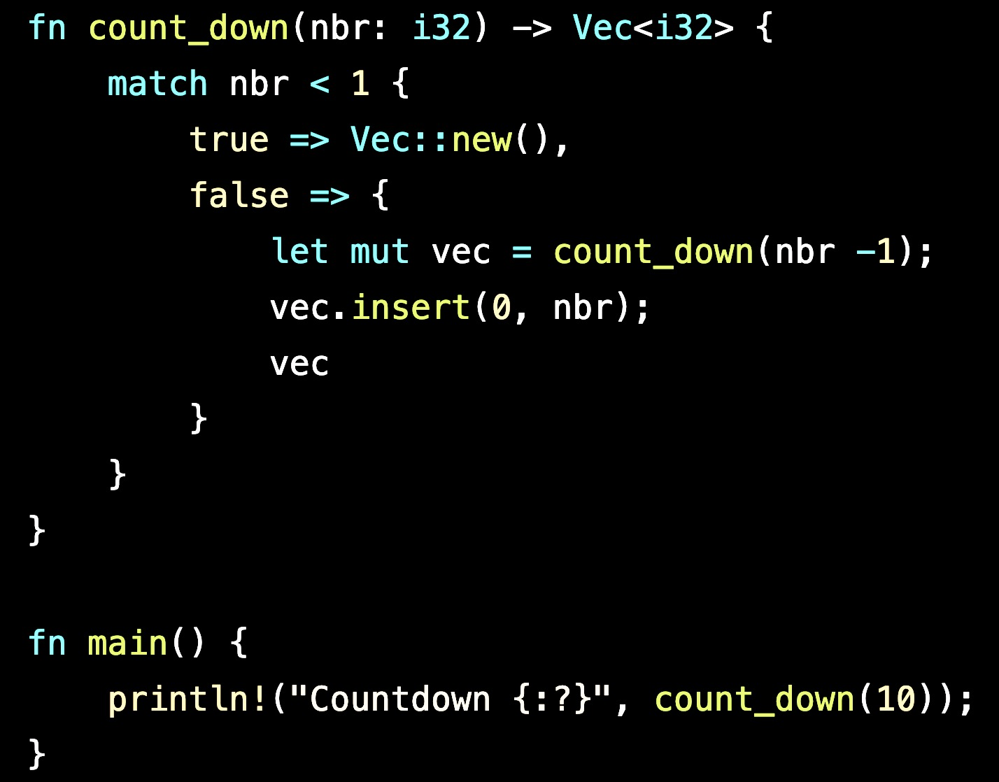

<h1>
Recursion
</h1>

Example of recursive functions using Rust

 
Recursion is a technique used to solve computer problems by creating a function that calls itself until the program achieves the desired result.

 

A recursive function consists of two parts: 
<ol>
    <li>The recursive call
    <li>The condition that stops a recursive function from calling itself know as the base case.
</ol>

 

The base case is the condition that checks to see if the condition you desired has been achieved.&nbsp;&nbsp;Every recursive function should have at least one base case.

 

 The base case within the example shown below,&nbsp;for the count_down function,&nbsp;is when nbr is less than 1.&nbsp;&nbsp;The recursive call is when the function calls itself,&nbsp;which adds to the recursice call stack.

 

        

 

The call stack is at the heart of the recursive function.&nbsp;&nbsp;It keeps track of each time the function is called.&nbsp;&nbsp;When the call stack hits a RETURN,&nbsp;it pops the current function off the stack and goes back to whichever function's now on top.&nbsp;&nbsp;So,&nbsp;when count_down(10) calls count_down(1),&nbsp;it's going to wait until count_down(1) ends before it can also end.&nbsp;&nbsp;Once count_down(1) ends,&nbsp;count_down(10) finishes its run.&nbsp;&nbsp;See sample output for the count_down(10) function below: 

 

Countdown [10, 9, 8, 7, 6, 5, 4, 3, 2, 1]

 

Pros:
<ol>
    <li>Recursion adds clarity and,&nbsp;sometimes,&nbsp;reduces the time needed to write and debug code,&nbsp;but,&nbsp;doesn't necessarily reduce space requirements or speed of execution.
    <li>Reduces time complexity.&nbsp;&nbsp;Performs better in solving problems based on tree structures.
    <li>It is a unique way of implementing a variable number of nested loops/iterations,&nbsp;and,&nbsp;the only elegant way of implementing a big constant number of nested loops.
</ol>

Cons:
<ol>
    <li>It is usually slower due to the overhead of maintaining the stack.
    <li>It usually uses more memory for the stack.
    <li>Recursive methods will often throw a StackOverflowException when processing big sets.&nbsp;&nbsp;Recursive loops/iterators don't have this problem.
</ol>

 

In summary,&nbsp;recursive functions are another tool in the toolbelt of a developer.&nbsp;&nbsp;Knowing when it should be used is the mark of a Professional Developer.

 

Thanks for reading and do reach out and let me know if you have any questions or concerns.&nbsp;&nbsp;Click 'Star' if you like the program.&nbsp;&nbsp;All suggestions,&nbsp;constructive,&nbsp;even non-constructive,&nbsp;will be welcomed.

 
 

 

[![MIT licensed][mit-badge]][mit-url]&nbsp;&nbsp;

 
 

### License

This project is licensed under the&nbsp;[MIT license](LICENSE).

[mit-badge]: https://img.shields.io/badge/license-MIT-blue.svg
[mit-url]: LICENSE
### Contribution

Unless you explicitly state otherwise, any contribution intentionally submitted
for inclusion in 'Recursion' by you, shall be licensed as MIT, without any additional terms or conditions.

